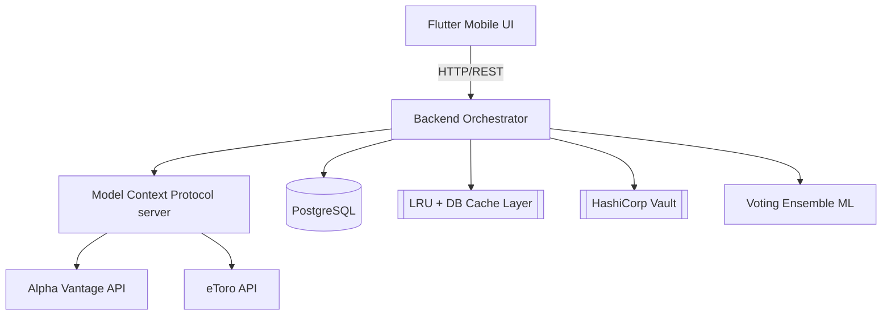

# Virtual Personal Finance Advisor — Raport Tehnic și de Reziliență

## 1. Introducere și Justificare
Sistemul a fost conceput pentru a gestiona date financiare critice într-un mediu distribuit, unde dependențele externe (eToro API, Alpha Vantage) pot eșua oricând. Lansarea eToro Public APIs ne-a permis trecerea la o arhitectură orientată pe AI (Agentic Workflow), cu scopul de a oferi investitorilor de retail o perspectivă clară asupra portofoliilor, fără zgomotul platformelor clasice de social trading. 

**De ce "Fără Execuție"?**
Aplicația este strict educațională și un suport decizional ("Human in the Loop"). Lipsa execuției automate protejează capitalul de posibile halucinații LLM.

## 2. Arhitectura Sistemului și Toleranța la Defecte
Aplicația utilizează următoarea stivă tehnologică robustă, având reziliența la bază:

### Mecanisme de Reziliență:
1. **Bulkhead Isolation:** Modulele eToro și Alpha Vantage sunt decuplate; eșecul unuia nu afectează sistemul.
2. **Circuit Breaker (`app/core/circuit_breaker.py`):** Previne spam-ul de endpoint-uri moarte. Un eșec de 5 ori deschide circuitul și trece în "fail-fast" pentru 60 de secunde.
3. **Graceful Degradation with Caching:** Cererile `market_data` pică direct pe un LRU Cache în RAM sau DB if Alpha Vantage depășește limita de cereri (429 Rate Limit).

## 3. Strategia de Gestiune a Defectelor (Case Studies)

### 3.1 Rate Limit Exceeded (Alpha Vantage 25 req/zi)
- **Defect:** Alpha Vantage impune un prag de 25 interogări/zi la nivel de cont free.
- **Implementare:** Modulul `CacheService` interceptează orice request de tip cotație înainte de `httpx`. Un counter memorează numărul de apeluri. Dacă depășește pragul sau dacă circuitul este deschis, sistemul servește ultima cotație valabilă reținută din baza PostgreSQL sau din Mock Data.

### 3.2 Latență Rețea & Conexiune DB 
- **Defect:** Baza de date Postgres pe WSL cade, sau API instabil.
- **Implementare:** Timouts asincrone integrate în serviciile proxy, retries pentru blocajele tranzacționale (SQLAlchemy asyncpg deadlock protection). Docker `pg_isready` garantează pornirea secvențială corectă.

### 3.3 Date Sensibile (eToro API Key Leakage)
- **Defect:** Baza de date poate fi exfiltrată.
- **Implementare:** Cheia API este salvată transparent doar prin `etoro_key`. Intern, setter-ul o criptează via AES-256-GCM. Cheia criptografică Master se trage asincron direct din `HashiCorp Vault` în `app/core/vault.py`.

## 4. Modulul de Anomali: Sistemul de Voting între 3 Modele
Pentru a găsi outliers în comportamentul portofoliilor, am ales o abordare Ensemble.

### Cele 3 Modele
1. **Isolation Forest (`isolation_forest.py`):** Antrenat pe un flux continuu. Isolează rapid anomaliile vizibile din arborele prețurilor medii.
2. **PCA Autoencoder (`lstm_autoencoder.py`):** Antrenat per user pentru reconstrucția "normalului spatial". O eroare mare MSE semnalizează un volatilitate bruscă pe mai multe poziții.
3. **One-Class SVM (`one_class_svm.py`):** Desenează frontiera comportamentului non-anomal. 

### Mecanismul de Voting
S-a implementat în `anomaly_service.py` un prag multi-vot. Scorul total este ponderea erorilor:
> \`Score = 0.4IF + 0.35AE + 0.25SVM\`
Dacă scorul depășește un treshold (sau 2 din 3 semnalează "TRUE"), sistemul marchează în portofoliu anomalia ca fiind certificată și notifică agentul Tori (prin istoric memorie).

## 5. Agentul AI conversațional (Tori) și MCP
Utilizăm Model Context Protocol via `FastMCP` pentru a mapa funcții de citire ale serviciului core Python spre Tools LangChain. 
- Modelele mari (Gemini 1.5 Flash via `langchain-google-genai` instalat și conectat) sunt invocate generând streaming responses direct în clientul Flutter. 
- Istoricul discuțiilor se preia asincron din PostgreSQL, translatând `role: user` în structurile suportate de model.

## 6. Implementare Software Frontend
Flutter Mobile/Desktop a fost configurat pentru a citi din API. Endpoint-urile de Auth sunt validate prin JWT, iar Dashboard-ul redă diagrame de performanță (OHLC folosind pachetele Fl_chart vizuale). 
Aplicația are stări de retry pentru backend downtime, semnalizând când comunicarea este imposibilă `Connection Refused` versus `Timeout`.

## 7. Concluzii și Studiu Rezultate
Construcția acestui advisor a adus laolaltă siguranța (Vault + AES256), inteligența algoritmică pasivă (Ensemble ML), consilierea activă (Tori via Gemini) și execuția asincronă defensivă (Circuit Breakers + Caching). Acest mix asigură un instrument extrem de performant, protejat de limitările tradiționale API Rate Limit (care blocau frecvent alte abordări financiare Python simple).
