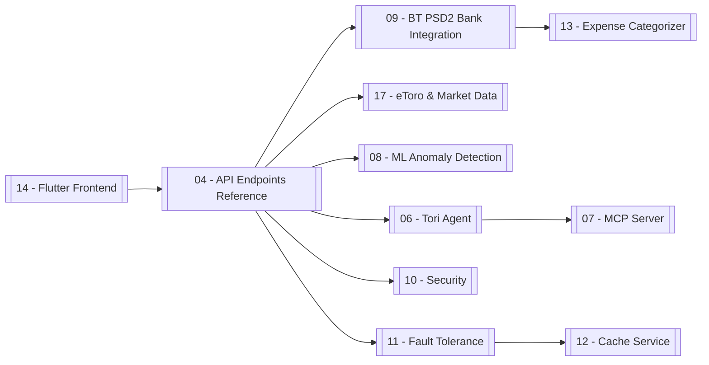

# 🗂️ Virtual Personal Finance Advisor — Documentation Index

Tags: #index #moc #home

Technical documentation vault for the **Virtual Personal Finance Advisor** — a full-stack (FastAPI + Flutter) platform combining real bank data (Banca Transilvania PSD2), investment portfolio tracking (eToro + Yahoo Finance), ML anomaly detection, and an LLM agent (Tori).

> Start at [[01 - System Overview]] for the architecture, or jump to a subsystem below.

---

## 🧭 Map of Content

### Architecture & Platform
| Note | Topic |
|---|---|
| [[01 - System Overview]] | Architecture diagram, tech stack, request lifecycle |
| [[02 - Docker & Deployment]] | Compose services, build, ports |
| [[03 - FastAPI Application]] | App wiring, routers, middleware, lifespan |
| [[15 - Dependencies]] | Python & Dart dependency inventory |

### API & Data
| Note | Topic |
|---|---|
| [[04 - API Endpoints Reference]] | Every REST endpoint + request/response shapes |
| [[05 - Database Models]] | SQLAlchemy tables & relationships |
| [[16 - Pydantic Schemas]] | Request/response validation models |

### Domain Subsystems
| Note | Topic |
|---|---|
| [[09 - BT PSD2 Bank Integration]] | OAuth2 PKCE, consent, sync, sandbox fallback |
| [[17 - eToro & Market Data]] | Public portfolio, $10k allocation model, instrument resolver, Yahoo Finance |
| [[13 - Expense Categorizer]] | Transaction categorization & subscription detection |
| [[08 - ML Anomaly Detection]] | Isolation Forest + Autoencoder + One-Class SVM ensemble |
| [[06 - Tori Agent]] | LangGraph ReAct agent over Gemini |
| [[07 - MCP Server]] | FastMCP financial tools exposed to Tori |

### Cross-Cutting Concerns
| Note | Topic |
|---|---|
| [[10 - Security]] | JWT, bcrypt, AES-256 field encryption, Vault |
| [[11 - Fault Tolerance]] | Circuit breakers, retries, mock fallback |
| [[12 - Cache Service]] | LRU + TTL cache |

### Frontend
| Note | Topic |
|---|---|
| [[14 - Flutter Frontend]] | 5-tab IndexedStack shell, Home overview, treemaps, auth, generative UI |

### Project History
| Note | Topic |
|---|---|
| [[18 - Changelog]] | Notable changes & fixes |

---

## 🔭 Subsystem-at-a-glance

---

## Conventions
- **Diagrams:** Mermaid (`graph`, `sequenceDiagram`, `stateDiagram`, `flowchart`).
- **Code blocks** show the *actual* implementation, trimmed for clarity.
- **Tags** group notes by theme (`#api`, `#bank`, `#etoro`, `#ml`, `#security`, …).
- Notes are numbered for ordering; links are bidirectional in the Obsidian graph.
