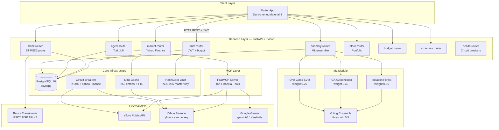
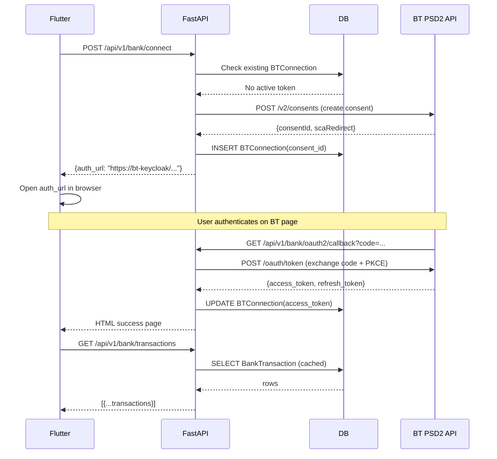

# 🏗️ System Overview

Tags: #architecture #overview

## Purpose

Virtual Personal Finance Advisor is a full-stack platform that helps users:
1. **Track** real bank transactions via Banca Transilvania PSD2 AISP API
2. **Monitor** investment portfolio via eToro API + Yahoo Finance market data
3. **Detect** unusual portfolio behaviour via ML anomaly ensemble
4. **Advise** through Tori, an LLM-powered conversational financial agent

> The application is **strictly educational / decision-support** (read-only). No automated trading or fund transfers are performed. This is intentional to protect users from LLM hallucinations.

---

## High-Level Architecture

---

## Technology Stack

| Layer | Technology | Version / Notes |
|---|---|---|
| **Frontend** | Flutter | Dart SDK ≥3.0.0, Material 3 |
| **Backend** | FastAPI | 0.135.1 + uvloop |
| **ORM** | SQLAlchemy (async) | 2.0.48 + asyncpg |
| **Database** | PostgreSQL | 16-alpine (Docker) |
| **Migrations** | Alembic | 1.18.4 |
| **AI Agent LLM** | Google Gemini | gemini-3.1-flash-lite |
| **Agent Framework** | LangGraph ReAct | create_react_agent |
| **MCP** | FastMCP | via `mcp` ≥1.26.0 |
| **ML** | scikit-learn | 1.5.2 + numpy 1.26.4 |
| **Cryptography** | cryptography | 44.0.2 (AES-256-CBC) |
| **JWT** | python-jose | 3.3.0 (HS256) |
| **Secrets** | HashiCorp Vault | hvac 2.1.0 |
| **HTTP Client** | httpx | 0.28.1 |
| **Container** | Docker / Compose | 3 services |

---

## Request Lifecycle (Happy Path)

---

## Data Domains

| Domain | Tables | External Service |
|---|---|---|
| Identity | `users` | — |
| Sessions | `chat_messages` | — |
| Portfolio | `assets`, `portfolio_positions` | eToro |
| Anomalies | `anomaly_logs` | scikit-learn |
| Banking | `bt_connections`, `bank_transactions`, `budgets` | BT PSD2 |
| Caching | `cache_entries` | — |

---

## Related Notes
- [[00 - Index]]
- [[02 - Docker & Deployment]]
- [[03 - FastAPI Application]]
- [[09 - BT PSD2 Bank Integration]]
- [[17 - eToro & Market Data]]
- [[14 - Flutter Frontend]]
- [[11 - Fault Tolerance]]
- [[18 - Changelog]]
