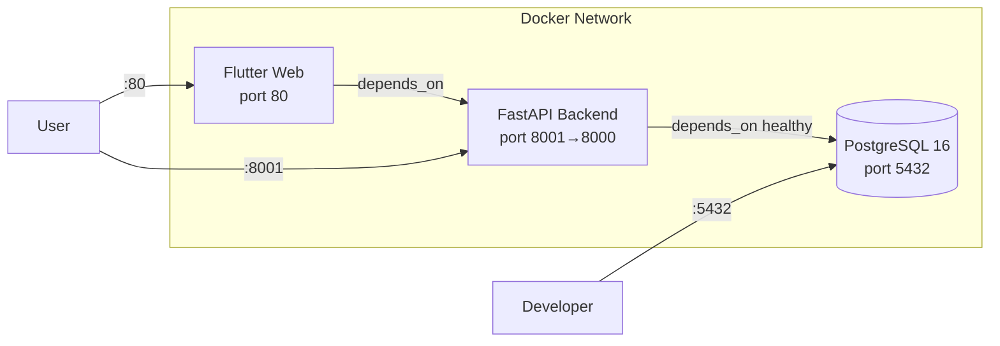

# 🚀 Docker & Deployment

Tags: #deployment #docker #infrastructure

## Services (docker-compose.yaml)



### Service Definitions

| Service | Image | Internal Port | Host Port | Restart |
|---|---|---|---|---|
| `db` | `postgres:16-alpine` | 5432 | 5432 | always |
| `backend` | Custom Dockerfile | 8000 | 8001 | always |
| `frontend` | Custom Dockerfile (nginx) | 80 | 80 | always |

---

## Backend Dockerfile

Located at `finance_advisor_backend/Dockerfile`:

```dockerfile
# Build context is the repo root (finance_advisor_backend/Dockerfile)
# Installed via requirements.txt
# Entrypoint: entrypoint.sh
# → waits for postgres, runs alembic upgrade head, then uvicorn
```

### Startup Script (`entrypoint.sh`)

```bash
#!/bin/bash
# Wait for postgres health → alembic upgrade head → uvicorn main:app
alembic upgrade head
uvicorn main:app --host 0.0.0.0 --port 8000 --loop uvloop
```

---

## Environment Variables

All configuration lives in `finance_advisor_backend/.env` (loaded by Docker Compose via `env_file`).
**No rebuild is needed** when changing credentials — only `docker-compose up -d backend`.

| Variable | Description | Default |
|---|---|---|
| `DATABASE_URL` | SQLAlchemy async URL | `postgresql+asyncpg://postgres:password@db:5432/finance_advisor` |
| `POSTGRES_USER` | DB user | `postgres` |
| `POSTGRES_PASSWORD` | DB password | `password` |
| `POSTGRES_DB` | Database name | `finance_advisor` |
| `SECRET_KEY` | JWT signing key (HS256) | — (must be set) |
| `GOOGLE_API_KEY` | Gemini API key | — |
| `ETORO_API_KEY` | eToro API key | — |
| `ETORO_USER_KEY` | eToro user key | — |
| `ETORO_BASE_URL` | eToro API base | `https://public-api.etoro.com` |
| `ETORO_ENV` | `demo` or `live` | `demo` |
| `ETORO_USERNAME` | eToro username | — |
| `USE_MOCK_DATA` | Use local mock data | `true` |
| `API_BASE_URL` | Flutter build arg | `http://localhost:8001/api/v1` |
| `BT_CLIENT_ID` | BT OAuth2 client ID | `sandbox_client_id` |
| `BT_CLIENT_SECRET` | BT OAuth2 secret | `sandbox_client_secret` |
| `BT_REDIRECT_URI` | OAuth2 redirect URI | `http://localhost:8001/api/v1/bank/oauth2/callback` |
| `USE_BT_SANDBOX` | Use BT sandbox | `true` |
| `VAULT_ADDR` | HashiCorp Vault URL | `http://127.0.0.1:8200` |
| `VAULT_TOKEN` | Vault auth token | `root` |
| `FALLBACK_MASTER_KEY` | AES key fallback | base64 of dev key |

---

## Quick Start Commands

### Development (local)

```bash
# Backend
cd finance_advisor_backend
pip install -r ../requirements.txt
uvicorn main:app --reload --host 0.0.0.0 --port 8000

# Frontend
cd flutter_app
flutter pub get
flutter run -d chrome          # Recommended for development
flutter run -d android         # Physical device
```

### Docker Production

```bash
# Build & start all services
docker-compose up --build -d

# Restart backend only (after .env changes)
docker-compose up -d backend

# View logs
docker-compose logs -f backend

# Stop all
docker-compose down
```

---

## Database Migrations (Alembic)

```
alembic/
├── env.py                            # Async engine setup
├── versions/
│   ├── 8b08314e19ad_create_users_table.py
│   ├── 002_add_bank_budget_tables.py
│   ├── b02120676b79_add_chat_messages_table.py
│   └── 7694897178ec_merge_multiple_heads.py   # merge head
```

Migration execution order:
1. `8b08314e19ad` → creates `users`, `assets`, `portfolio_positions`, `anomaly_logs`
2. `002_add_bank_budget_tables` → adds `bt_connections`, `bank_transactions`, `budgets`, `cache_entries`
3. `b02120676b79` → adds `chat_messages`
4. `7694897178ec` → merge commit (no DDL)

---

## Accessing Services

| URL | Description |
|---|---|
| `http://localhost` | Flutter Web UI |
| `http://localhost:8001` | Backend API root |
| `http://localhost:8001/docs` | Swagger UI (OpenAPI) |
| `http://localhost:8001/api/v1/health` | Health check JSON |
| `http://localhost:5432` | PostgreSQL (psql / DBeaver) |

---

## BT PSD2 Redirect URI & ngrok

BT OAuth2 requires **HTTPS** for the redirect URI. Use ngrok for local development:

```bash
ngrok http 8001
# → https://xxxx.ngrok-free.app

# Register a new BT client
curl -X POST https://api.apistorebt.ro/bt/sb/oauth/register \
  -H "Content-Type: application/json" \
  -d '{"redirect_uris":["https://xxxx.ngrok-free.app/api/v1/bank/oauth2/callback"],"client_name":"Virtual Finance Advisor"}'
```

> ⚠️ Every time ngrok restarts (new URL), you must register a **new** BT client. Reusing the old `client_id` with a new redirect URI causes a Keycloak error.

---

## Related Notes
- [[01 - System Overview]]
- [[09 - BT PSD2 Bank Integration]]
- [[10 - Security]]
