# ⚙️ FastAPI Application

Tags: #backend #fastapi #python

## Entry Point — `main.py`

The application is a **FastAPI** instance using `uvloop` async event loop for maximum performance.

```python
app = FastAPI(
    title="Virtual Finance Advisor API",
    description="...",
    version="1.0.0",
    lifespan=lifespan,           # async context manager for startup/shutdown
)
```

---

## Lifespan Hook (Startup)

```python
@asynccontextmanager
async def lifespan(app: FastAPI):
    # 1. Pre-register circuit breakers (appear in /health from first request)
    get_circuit_breaker("etoro")
    get_circuit_breaker("yahoo_finance")

    # 2. ML models are lazy-initialized (auto-train on first /anomaly/analyze call)
    yield
    # Shutdown code here (graceful)
```

---

## Routers

| Prefix | Module | Tag |
|---|---|---|
| `/api/v1/market` | `endpoints/market.py` | Market Data |
| `/api/v1/etoro` | `endpoints/etoro.py` | eToro |
| `/api/v1/auth` | `endpoints/auth.py` | Authentication |
| `/api/v1/anomaly` | `endpoints/anomaly.py` | Anomaly Detection |
| `/api/v1` | `endpoints/health.py` | Health |
| `/api/v1/agent` | `endpoints/agent.py` | AI Agent |
| `/api/v1/bank` | `endpoints/bank.py` | Bank (BT PSD2) |
| `/api/v1/budget` | `endpoints/budget.py` | Budget Manager |
| `/api/v1/expenses` | `endpoints/expenses.py` | Expense Analytics |

---

## CORS Configuration

```python
app.add_middleware(
    CORSMiddleware,
    allow_origins=["*"],          # TODO: restrict in production
    allow_credentials=True,
    allow_methods=["*"],
    allow_headers=["*"],
)
```

> ⚠️ `allow_origins=["*"]` is intentionally permissive for development. In production, restrict to Flutter app's actual origin.

---

## Module Dependency Graph

```mermaid
graph TD
    main["main.py"] --> auth["auth endpoint"]
    main --> bank["bank endpoint"]
    main --> agent["agent endpoint"]
    main --> anomaly["anomaly endpoint"]
    main --> market["market endpoint"]
    main --> etoro["etoro endpoint"]
    main --> budget["budget endpoint"]
    main --> expenses["expenses endpoint"]
    main --> health["health endpoint"]

    auth --> security["core/security.py"]
    auth --> db["core/database.py"]
    auth --> userModel["models/user.py"]

    bank --> btService["services/bt_service.py"]
    bank --> expCat["services/expense_categorizer.py"]
    bank --> bankModels["models/bank_transaction.py\nmodels/bank_connection.py"]

    agent --> toriAgent["agent/tori_agent.py"]
    toriAgent --> mcpServer["mcp/server.py"]
    toriAgent --> agentMemory["agent/memory.py"]

    anomaly --> anomalyService["ml/anomaly_service.py"]
    anomalyService --> iforest["ml/isolation_forest.py"]
    anomalyService --> autoenc["ml/autoencoder.py"]
    anomalyService --> svm["ml/one_class_svm.py"]
    anomalyService --> voting["ml/voting_ensemble.py"]

    market --> cacheService["services/cache_service.py"]
    market --> marketService["services/market_data.py"]

    security --> vault["core/vault.py"]
    db --> config["core/config.py"]
```



---

## Configuration (`core/config.py`)

Uses **pydantic-settings** `BaseSettings` with `lru_cache` singleton:

```python
class Settings(BaseSettings):
    etoro_api_key: str = ""
    secret_key: str = "default_secret_key_for_dev_only"
    google_api_key: str = ""
    use_mock_data: bool = True
    database_url: str                    # required
    bt_client_id: str = "sandbox_client_id"
    bt_client_secret: str = "sandbox_client_secret"
    bt_base_url: str = "https://api.apistorebt.ro/bt/sb"
    bt_redirect_uri: str = "http://localhost:8001/api/v1/bank/oauth2/callback"
    ...
    model_config = SettingsConfigDict(env_file=".env", extra="ignore")

@lru_cache()
def get_settings() -> Settings: ...
```

---

## Database Setup (`core/database.py`)

```python
engine = create_async_engine(
    settings.database_url,       # postgresql+asyncpg://...
    echo=True,                   # Set False in Production
    future=True
)

AsyncSessionLocal = async_sessionmaker(
    bind=engine, class_=AsyncSession, expire_on_commit=False
)

class Base(DeclarativeBase): pass

async def get_db():             # FastAPI dependency injection
    async with AsyncSessionLocal() as session:
        try:
            yield session
        finally:
            await session.close()
```

---

## Related Notes
- [[04 - API Endpoints Reference]]
- [[05 - Database Models]]
- [[10 - Security]]
- [[11 - Fault Tolerance]]
