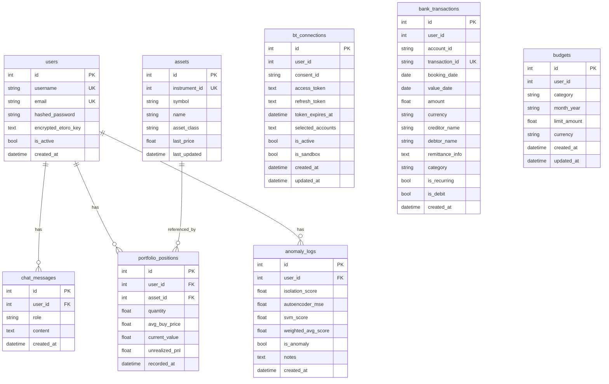

# 🗄️ Database Models

Tags: #database #orm #sqlalchemy #postgresql

## Overview

All models inherit from `Base` (SQLAlchemy `DeclarativeBase`).  
The database is PostgreSQL 16, accessed via `asyncpg` through SQLAlchemy's async engine.

---

## Entity Relationship Diagram



---

## `User` (`users`)

```python
class User(Base):
    __tablename__ = "users"

    id: Mapped[int]                          # PK
    username: Mapped[str]                    # unique, indexed, max 64 chars
    email: Mapped[str]                       # unique, indexed, max 255 chars
    hashed_password: Mapped[str]             # bcrypt hash
    encrypted_etoro_key: Mapped[str | None]  # AES-256-CBC encrypted, nullable
    is_active: Mapped[bool]                  # default True
    created_at: Mapped[datetime]             # UTC timestamp
```

**Relationships:**
- `portfolio_positions` → `PortfolioPosition` (cascade delete)
- `anomaly_logs` → `AnomalyLog` (cascade delete)
- `chat_history` → `ChatMessage` (via backref)

**Property getter/setter** — `etoro_key` transparently encrypts/decrypts via `encrypt_field`/`decrypt_field`.

---

## `ChatMessage` (`chat_messages`)

```python
class ChatMessage(Base):
    __tablename__ = "chat_messages"

    id: Mapped[int]
    user_id: Mapped[int]     # FK → users.id, indexed
    role: Mapped[str]        # "user" or "assistant", max 20 chars
    content: Mapped[str]     # Text (unlimited)
    created_at: Mapped[datetime]
```

**Purpose:** Persists Tori conversation history across sessions. Retrieved in reverse-chronological order (last 10) and fed to LangGraph as context.

---

## `Asset` (`assets`)

```python
class Asset(Base):
    __tablename__ = "assets"

    id: Mapped[int]
    instrument_id: Mapped[int]       # eToro numeric ID, unique
    symbol: Mapped[str]              # e.g. "AAPL", indexed
    name: Mapped[str]                # Full name, max 255
    asset_class: Mapped[str]         # "Stocks" | "Crypto" | "Forex"
    last_price: Mapped[float | None] # Nullable — updated on market sync
    last_updated: Mapped[datetime | None]
```

---

## `PortfolioPosition` (`portfolio_positions`)

```python
class PortfolioPosition(Base):
    __tablename__ = "portfolio_positions"

    id: Mapped[int]
    user_id: Mapped[int]         # FK → users.id
    asset_id: Mapped[int]        # FK → assets.id
    quantity: Mapped[float]
    avg_buy_price: Mapped[float]
    current_value: Mapped[float]
    unrealized_pnl: Mapped[float]  # default 0.0
    recorded_at: Mapped[datetime]
```

**Relationships:**
- `user` → `User` (back_populates)
- `asset` → `Asset` (back_populates)

---

## `AnomalyLog` (`anomaly_logs`)

```python
class AnomalyLog(Base):
    __tablename__ = "anomaly_logs"

    id: Mapped[int]
    user_id: Mapped[int]             # FK → users.id
    isolation_score: Mapped[float]   # IF anomaly score [0,1]
    autoencoder_mse: Mapped[float]   # AE reconstruction error [0,1]
    svm_score: Mapped[float]         # SVM anomaly score [0,1]
    weighted_avg_score: Mapped[float] # Ensemble result [0,1]
    is_anomaly: Mapped[bool]          # Final verdict
    notes: Mapped[str | None]         # Human-readable breakdown
    created_at: Mapped[datetime]
```

---

## `BTConnection` (`bt_connections`)

```python
class BTConnection(Base):
    __tablename__ = "bt_connections"

    id: int                    # PK
    user_id: int               # indexed (no FK constraint)
    consent_id: str            # BT PSD2 consent ID
    access_token: Text         # BT OAuth2 access token
    refresh_token: Text        # BT OAuth2 refresh token
    token_expires_at: datetime # Token expiry UTC
    selected_accounts: Text    # JSON: account IDs or _pkce_verifier / _demo_mode flags
    is_active: bool
    is_sandbox: bool
    created_at / updated_at: datetime
```

**Notes:**
- `selected_accounts` is dual-purpose JSON:
  - During consent flow: `{"_pkce_verifier": "..."}`
  - In demo mode: `{"_demo_mode": true}`
  - After auth: `null` (cleared)

---

## `BankTransaction` (`bank_transactions`)

```python
class BankTransaction(Base):
    __tablename__ = "bank_transactions"

    id: int
    user_id: int               # indexed
    account_id: str            # BT resource_id, indexed
    transaction_id: str        # BT unique ID, unique constraint
    booking_date: Date
    value_date: Date
    amount: float              # negative = debit (outgoing)
    currency: str              # default "RON"
    creditor_name: str
    debtor_name: str
    remittance_info: Text      # BT remittanceInformationUnstructured
    category: str              # Classified by expense_categorizer
    is_recurring: bool         # Detected by detect_recurring()
    is_debit: bool             # True if amount < 0
    created_at: datetime
```

---

## `Budget` (`budgets`)

```python
class Budget(Base):
    __tablename__ = "budgets"

    id: int
    user_id: int               # indexed
    category: str              # e.g. "Food & Groceries"
    month_year: str            # "YYYY-MM" format
    limit_amount: float        # user-defined spending cap
    currency: str              # default "RON"
    created_at / updated_at: datetime
```

---

## Migration History

| Revision | Description |
|---|---|
| `8b08314e19ad` | Create `users`, `assets`, `portfolio_positions`, `anomaly_logs` |
| `002_add_bank_budget_tables` | Add `bt_connections`, `bank_transactions`, `budgets`, `cache_entries` |
| `b02120676b79` | Add `chat_messages` table |
| `7694897178ec` | Merge multiple heads (no DDL) |

---

## Related Notes
- [[03 - FastAPI Application]]
- [[10 - Security]]
- [[09 - BT PSD2 Bank Integration]]
