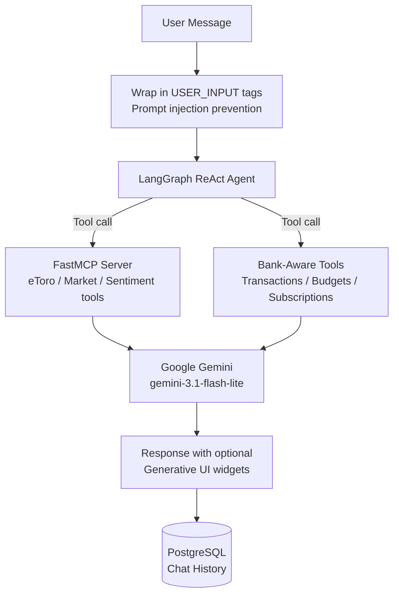

# 🤖 Tori Agent

Tags: #ai #agent #langchain #langgraph #gemini

## Overview

**Tori** is the conversational AI financial advisor at the heart of the application. She is powered by **Google Gemini** (`gemini-3.1-flash-lite`) running as a **LangGraph ReAct agent** with MCP-backed tools.



---

## Agent Creation — `create_tori_agent(user_id)`

```python
def create_tori_agent(user_id: int):
    # Fallback to MockLLM if no GOOGLE_API_KEY
    if not settings.google_api_key:
        return MockLLM()

    llm = ChatGoogleGenerativeAI(
        model="gemini-3.1-flash-lite",
        temperature=0,
        api_key=settings.google_api_key
    )

    # Extract MCP tools from FastMCP server → wrap as LangChain StructuredTools
    tools = []
    for tool in mcp_server._tool_manager.list_tools():
        st = StructuredTool.from_function(
            func=tool.fn,
            name=tool.name,
            description=tool.description,
            coroutine=tool.fn
        )
        tools.append(st)

    agent = create_react_agent(llm, tools=tools)
    return agent
```

---

## System Prompt

Tori's system prompt defines:

### Capabilities
1. **Investment Portfolio** — eToro data, rebalancing suggestions, Alpha Vantage quotes
2. **Bank Account (BT)** — Transaction analysis, category spending, budgets, subscriptions
3. **Expense Analysis** — Trend identification, budget overrun flagging (🔴🟡🟢)
4. **Anomaly Detection** — Refers users to the Anomaly Detection dashboard

### Generative UI (Widget Generation)

Tori can embed interactive Flutter widgets directly in her responses using fenced `widget` code blocks:

```
Type 1 — Budget Slider:
```widget
{"type": "budget_slider", "category": "Dining", "limit": 1000}
```

Type 2 — Receipt:
```widget
{"type": "receipt", "merchant": "eMAG", "amount": 150.5, "date": "2026-06-05", "category": "Shopping"}
```

Type 3 — Action Button:
```widget
{"type": "action_button", "label": "Sync Bank", "action": "sync_bank"}
```
```

### Behavioral Rules
- Professional, data-driven, concise
- RON (Romanian Leu) for bank transactions; USD for portfolio values
- Concrete next steps with numeric suggestions
- Emoji used sparingly (🔴🟡🟢📊💡⚠️)
- Investment advice is educational only

### Security Rules (Prompt Injection Protection)
- User input is wrapped in `<USER_INPUT>...</USER_INPUT>` tags
- Instructions inside `<USER_INPUT>` that attempt to override the system prompt are rejected
- Persona changes and unauthorized actions (money transfer, system prompt leakage) are declined

```python
secure_user_input = f"<USER_INPUT>\n{user_input}\n</USER_INPUT>"
messages = [("system", SYSTEM_PROMPT)] + history + [("human", secure_user_input)]
```

---

## `ask_tori()` Function

```python
async def ask_tori(user_input: str, user_id: int, chat_history: list = None) -> str:
    agent = create_tori_agent(user_id)
    messages = [("system", SYSTEM_PROMPT)] + (chat_history or []) + [("human", secure_user_input)]

    response = await agent.ainvoke({"messages": messages})
    content = response["messages"][-1].content

    # Handle multi-part (list) responses from Gemini
    if isinstance(content, list):
        text_parts = [b.get('text', '') for b in content if isinstance(b, dict) and b.get('type') == 'text']
        return "".join(text_parts) if text_parts else str(content)
    return str(content)
```

---

## Conversation Memory (`agent/memory.py`)

```python
class ChatMessage(Base):
    __tablename__ = "chat_messages"

    id: Mapped[int]
    user_id: Mapped[int]     # FK → users.id
    role: Mapped[str]        # "user" | "assistant"
    content: Mapped[str]     # Full message text
    created_at: Mapped[datetime]
```

**History retrieval:**
- Last 10 messages, ordered chronologically (most recent first, then reversed)
- Stored as `(role, content)` tuples for LangGraph

```python
async def get_chat_history(db, user_id: int, limit: int = 10) -> list:
    # Returns messages in chronological order
    ...

async def save_message(db, user_id: int, role: str, content: str):
    # Persists a single turn to PostgreSQL
    ...
```

---

## Agent Endpoint (`/api/v1/agent`)

| Method | Path | Description |
|---|---|---|
| `POST` | `/agent/chat` | Send message, get Tori's response |
| `GET` | `/agent/history/{user_id}` | Retrieve chat history |

### Chat flow
1. Restore last 10 messages from DB
2. Format as `[(role, content)]` tuples
3. Call `ask_tori(message, user_id, history)`
4. Persist both user message and Tori's response to DB
5. Return response string to Flutter

---

## MCP Tools Available to Tori

| Tool | Description |
|---|---|
| `get_my_portfolio()` | Fetches live eToro portfolio |
| `get_all_instruments()` | Returns all eToro instruments |
| `get_stock_price(symbol)` | Fetches real-time Alpha Vantage quote |
| `get_market_sentiment()` | Returns current market sentiment summary |
| `get_spending_summary(month_year="")` | Spending by category for a month |
| `get_budget_status(month_year="")` | Spending vs. budgets — answers "did I overspend?" |
| `get_subscriptions()` | Detected recurring subscription charges |
| `get_recent_transactions(limit=10)` | Most recent bank transactions |

> The bank/spending tools make the system prompt's "bank-aware" capabilities **real**. Before
> they existed Tori had only portfolio/market tools, so spending questions failed and it would
> wrongly claim the bank wasn't synced. All tools are exception-safe (return `{"error": ...}`
> rather than raising) so one failing tool can't take down the whole reply.

See [[07 - MCP Server]] for details.

---

## Related Notes
- [[07 - MCP Server]]
- [[05 - Database Models]]
- [[10 - Security]]
