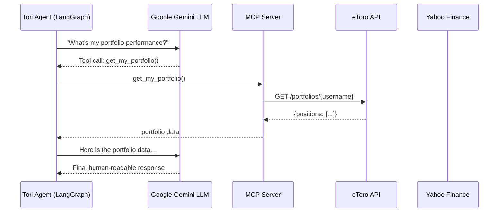

# 🔗 MCP Server

Tags: #mcp #model-context-protocol #fastmcp #tools

## What is MCP?

The **Model Context Protocol (MCP)** is an open standard that allows LLMs to call external tools in a structured, type-safe manner. This project uses **FastMCP** (`mcp>=1.26.0`) to expose Python functions as tools that the Tori LangGraph agent can invoke.

---

## Server Definition (`app/mcp/server.py`)

```python
from mcp.server.fastmcp import FastMCP
from app.services.etoro import EtoroService
from app.services.market_data import MarketDataService
from app.core.database import AsyncSessionLocal          # bank tools open their own session
from app.models.bank_transaction import BankTransaction
from app.models.budget import Budget
from app.services.expense_categorizer import get_spending_by_category, extract_subscriptions

DEFAULT_USER_ID = 1

etoro_service = EtoroService()
market_service = MarketDataService()

mcp_server = FastMCP("Tori Financial Assistant")
```

---

## Registered Tools

### Investment / market

| Tool Name | Signature | Description |
|---|---|---|
| `get_my_portfolio` | `() → dict` | Fetches the current live portfolio from eToro |
| `get_all_instruments` | `() → list` | Returns all known eToro instruments |
| `get_stock_price` | `(symbol: str) → dict` | Real-time quote via Yahoo Finance |
| `get_market_sentiment` | `() → dict` | Hardcoded market sentiment summary |

### Bank / spending (read the already-synced BT transactions in the DB)

| Tool Name | Signature | Description |
|---|---|---|
| `get_spending_summary` | `(month_year="") → dict` | Spending grouped by category for a month |
| `get_budget_status` | `(month_year="") → dict` | Spending vs. budget limits — answers "did I overspend?" (`has_budgets` flags if none set) |
| `get_subscriptions` | `() → list` | Detected recurring subscription charges |
| `get_recent_transactions` | `(limit=10) → list` | Most recent bank transactions |

> These bank tools open their own `AsyncSessionLocal()` (no FastAPI DI) and operate on
> `DEFAULT_USER_ID = 1` (auth isn't enforced — see [[10 - Security]]). They were added so the
> agent's prompt claims about bank/budget awareness are actually backed by data; previously Tori
> had only the portfolio/market tools and would falsely claim "the bank isn't synced".

### Resilience — tools must never raise

A tool that raises aborts the **entire** LangGraph turn (the user then sees Tori as
"temporarily unavailable"). Every tool therefore catches its own errors and returns an
`{"error": ...}` result (or `[]`), letting the agent recover and answer gracefully.

```python
@mcp_server.tool()
async def get_stock_price(symbol: str) -> dict:
    """Fetches the current real-time quote for a given symbol."""
    try:
        return await market_service.get_stock_quote(symbol)
    except Exception as e:
        logger.warning(f"[MCP] get_stock_price({symbol}) failed: {e}")
        return {"error": f"Could not fetch a price for '{symbol}'. "
                         "The symbol may be invalid or the market-data limit was reached."}

@mcp_server.tool()
async def get_budget_status(month_year: str = "") -> dict:
    """Compare spending against budgets for a month — answers 'did I overspend?'."""
    my = month_year or date.today().strftime("%Y-%m")
    async with AsyncSessionLocal() as db:
        budgets = (await db.execute(select(Budget).where(
            Budget.user_id == DEFAULT_USER_ID, Budget.month_year == my))).scalars().all()
        txns = (await db.execute(select(BankTransaction).where(
            BankTransaction.user_id == DEFAULT_USER_ID,
            BankTransaction.is_debit == True,
            BankTransaction.booking_date.cast(String).like(f"{my}%")))).scalars().all()
    # ... aggregate spent-per-category, compare to each limit → ok|warning|exceeded
    return {"month_year": my, "has_budgets": len(budgets) > 0, "budgets": [...]}
```

---

## Integration with Tori Agent

Tools are wired into the LangGraph ReAct agent via `StructuredTool.from_function()`:

```python
for tool in mcp_server._tool_manager.list_tools():
    st = StructuredTool.from_function(
        func=tool.fn,
        name=tool.name,
        description=tool.description,
        coroutine=tool.fn       # async support
    )
    tools.append(st)

agent = create_react_agent(llm, tools=tools)
```

The agent autonomously decides which tools to call based on the user's question using the ReAct (Reasoning + Acting) pattern.

---

## Tool Call Flow



---

## Why FastMCP over HTTP MCP?

FastMCP runs **in-process** — there's no separate MCP HTTP server to manage. The tools are Python functions registered via `@mcp_server.tool()` and called directly through the `_tool_manager`, avoiding network overhead and simplifying deployment.

---

## Related Notes
- [[06 - Tori Agent]]
- [[03 - FastAPI Application]]
