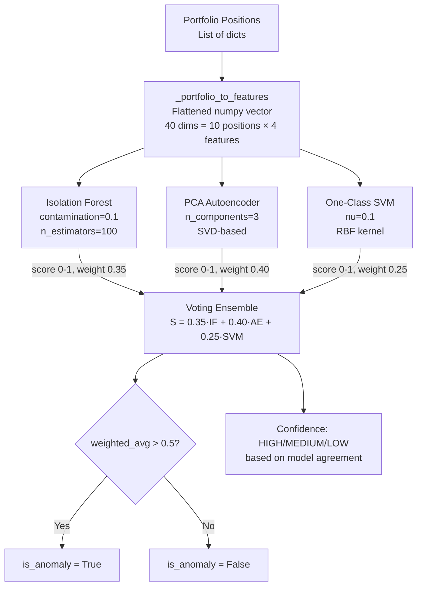

# 🧠 ML Anomaly Detection

Tags: #ml #anomaly #ensemble #sklearn

## Overview

The anomaly detection system uses a **3-model voting ensemble** to identify unusual patterns in a user's investment portfolio. Each model is independently trained and contributes a normalized score `[0, 1]`, where `1 = highly anomalous`.



---

## Feature Engineering (`anomaly_service.py`)

```python
def _portfolio_to_features(positions: list[dict]) -> np.ndarray:
    MAX_POSITIONS = 10
    features_per_pos = 4  # quantity, avgBuyPrice, currentValue, unrealizedPnL

    vec = np.zeros(MAX_POSITIONS * features_per_pos, dtype=np.float32)
    for i, pos in enumerate(positions[:MAX_POSITIONS]):
        offset = i * features_per_pos
        vec[offset]     = float(pos.get("quantity", 0))
        vec[offset + 1] = float(pos.get("avgBuyPrice", pos.get("avg_buy_price", 0)))
        vec[offset + 2] = float(pos.get("currentValue", pos.get("current_value", 0)))
        vec[offset + 3] = float(pos.get("unrealizedPnL", pos.get("unrealized_pnl", 0)))
    return vec  # shape: (40,)
```

**Input:** Up to 10 portfolio positions. Each contributes 4 features.  
**Output:** Fixed-size 40-dimensional float32 vector (zero-padded if fewer than 10 positions).

---

## Auto-Training on Synthetic Data

When no real historical data exists, models are auto-trained on **synthetic normal data**:

```python
def _generate_normal_history(reference: np.ndarray, n_samples: int = 50) -> np.ndarray:
    rng = np.random.default_rng(42)
    noise = rng.uniform(-0.05, 0.05, size=(n_samples, len(reference)))
    history = reference[np.newaxis, :] * (1 + noise)
    return history.astype(np.float32)
```

- Generates 50 synthetic samples with ±5% Gaussian-like noise around the current snapshot
- Used as the "normal" training set for initial warm-up
- Models retrain on real data via `retrain(historical_snapshots)` when sufficient history exists

---

## Model: Isolation Forest (`ml/isolation_forest.py`)

**Principle:** Anomalies are isolated faster (shorter average tree depth) because they occupy sparse regions of feature space.

```python
class IsolationForestModel:
    def __init__(self, contamination=0.1, n_estimators=100, random_state=42):
        self._model = IsolationForest(...)

    def score(self, x: np.ndarray) -> float:
        raw = self._model.score_samples(x.reshape(1, -1))
        # sklearn scores: (-inf, 0], more negative = more anomalous
        # Normalize to [0, 1]: clip(-raw * 2.0, 0, 1)
        normalized = float(np.clip(-raw[0] * 2.0, 0.0, 1.0))
        return normalized
```

| Parameter | Value | Meaning |
|---|---|---|
| `contamination` | 0.1 | Expected 10% of training data is anomalous |
| `n_estimators` | 100 | Number of isolation trees |
| `random_state` | 42 | Reproducibility |
| **Weight in ensemble** | **0.35** | |

---

## Model: PCA Autoencoder (`ml/autoencoder.py`)

**Principle:** Compress normal data into a low-dimensional subspace, then reconstruct it. High MSE at inference = pattern deviates from learned normal behavior.

**Implementation:** SVD-based linear autoencoder (no PyTorch/TF) — lightweight, zero extra dependencies.

```python
class AutoencoderModel:
    def __init__(self, n_components=3):
        self._components = None  # V^T from SVD, shape: (n_components, n_features)
        self._mean = None

    def train(self, X):
        self._mean = X.mean(axis=0)
        X_centered = X - self._mean
        U, S, Vt = np.linalg.svd(X_centered, full_matrices=False)
        self._components = Vt[:n_comp]  # Keep top n components
        # Compute max training reconstruction error for normalization
        self._max_mse = max(self._reconstruction_mse(X[i]) for i in range(len(X)))

    def _reconstruction_mse(self, x):
        x_c = x - self._mean
        encoded = self._components @ x_c         # Project to reduced space
        decoded = self._components.T @ encoded   # Reconstruct
        return float(np.mean((x - (decoded + self._mean)) ** 2))

    def score(self, x):
        mse = self._reconstruction_mse(x)
        return float(np.clip(mse / (self._max_mse + 1e-8), 0.0, 1.0))
```

| Parameter | Value |
|---|---|
| `n_components` | 3 |
| **Weight in ensemble** | **0.40** (highest — best temporal sensitivity) |

---

## Model: One-Class SVM (`ml/one_class_svm.py`)

**Principle:** Learns a hypersphere boundary in kernel-mapped feature space around normal data. Points outside = anomalous.

```python
class OneClassSVMModel:
    def __init__(self, nu=0.1, kernel="rbf", gamma="scale"):
        self._model = OneClassSVM(nu=nu, kernel=kernel, gamma=gamma)
        self._scaler = StandardScaler()   # Always scale inputs

    def score(self, x):
        x_scaled = self._scaler.transform(x.reshape(1, -1))
        raw = float(self._model.score_samples(x_scaled)[0])
        # Normalize: [min_score, max_score] → [1, 0] (inverted — high score = anomaly)
        normalized = 1.0 - (raw - self._min_score) / (self._max_score - self._min_score)
        return float(np.clip(normalized, 0.0, 1.0))
```

| Parameter | Value |
|---|---|
| `nu` | 0.1 (≈ expected anomaly rate) |
| `kernel` | RBF |
| `gamma` | `scale` |
| **Weight in ensemble** | **0.25** |

---

## Voting Ensemble (`ml/voting_ensemble.py`)

```python
DEFAULT_WEIGHTS = (0.35, 0.40, 0.25)  # (isolation_forest, autoencoder, svm)
DEFAULT_THRESHOLD = 0.5

class VotingEnsemble:
    def vote(self, isolation_score, autoencoder_score, svm_score) -> VotingResult:
        total_weight = self.w_if + self.w_ae + self.w_svm
        weighted = (
            self.w_if * isolation_score +
            self.w_ae * autoencoder_score +
            self.w_svm * svm_score
        ) / total_weight

        is_anomaly = weighted > self.threshold   # 0.5

        # Confidence based on individual model agreement
        individual_votes = [
            isolation_score > 0.5,
            autoencoder_score > 0.5,
            svm_score > 0.5,
        ]
        agreed = sum(individual_votes)
        confidence = "HIGH" if agreed == 3 else ("MEDIUM" if agreed == 2 else "LOW")

        return VotingResult(
            isolation_score, autoencoder_score, svm_score,
            weighted_avg_score=weighted, is_anomaly=is_anomaly,
            confidence=confidence, notes=f"..."
        )
```

### Ensemble Formula

```
S_weighted = (0.35 × IF_score + 0.40 × AE_score + 0.25 × SVM_score) / 1.00

is_anomaly = S_weighted > 0.5
```

### Confidence Levels

| Agreement | Confidence |
|---|---|
| 3/3 models flag anomaly | HIGH |
| 2/3 models flag anomaly | MEDIUM |
| 0-1/3 models flag anomaly | LOW |

---

## Model Weight Rationale

| Model | Weight | Rationale |
|---|---|---|
| Autoencoder (PCA) | 0.40 | Highest sensitivity to temporal/structural patterns in financial data |
| Isolation Forest | 0.35 | Excellent outlier detection in high-dimensional tabular datasets |
| One-Class SVM | 0.25 | Strong structural boundary learning but sensitive to scale/noise |

---

## Singleton Models (Process-Level)

```python
_if_model = IsolationForestModel(contamination=0.1)
_ae_model = AutoencoderModel(n_components=3)
_svm_model = OneClassSVMModel(nu=0.1)
_ensemble = VotingEnsemble()
_models_trained = False   # Auto-train on first call
```

Models are **module-level singletons** — they persist across HTTP requests within the same process. Pure numpy — no I/O — so they are safe for asyncio without locking.

---

## Related Notes
- [[04 - API Endpoints Reference]]
- [[05 - Database Models]]
- [[03 - FastAPI Application]]
