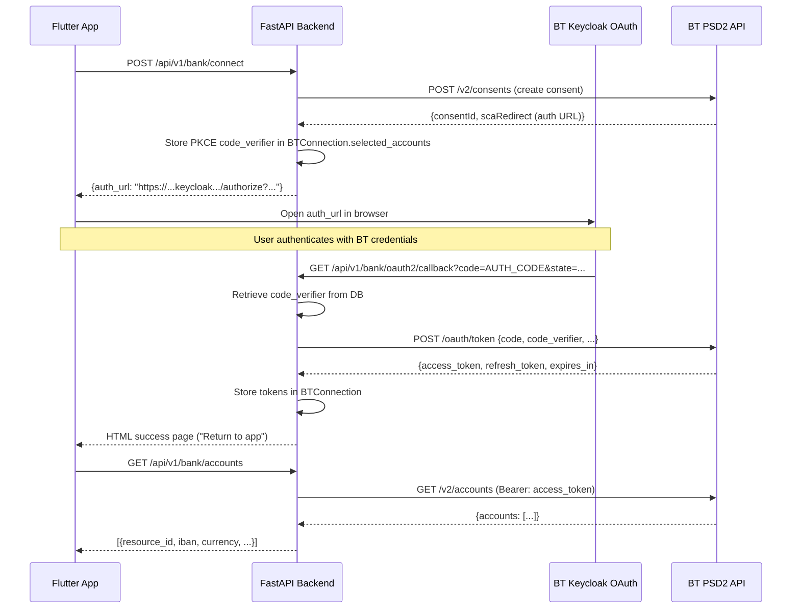
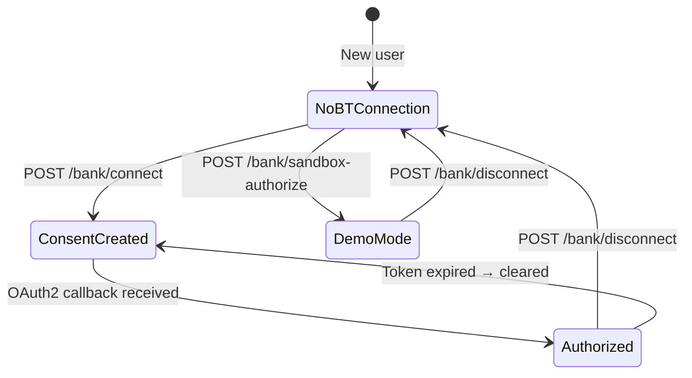
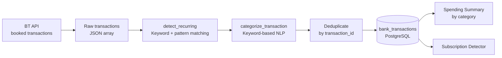

# 🏛️ BT PSD2 Bank Integration

Tags: #bank #psd2 #oauth2 #pkce #banca-transilvania

## Overview

The application integrates with **Banca Transilvania** (Romania's largest bank) via its **PSD2 AISP API v2** (NextGenPSD2 / BerlinGroup standard), exposed through the [BT API Store](https://apistorebt.ro).

**AISP** = Account Information Service Provider — read-only access to:
- Account listing and IBAN
- Account balances
- Transaction history (90+ days)

---

## OAuth2 PKCE Authorization Flow



---

## Connection States



---

## Demo / Sandbox Modes

The application has **three operating modes**:

| Mode | Description | How to activate |
|---|---|---|
| **Real BT** | Full PSD2 OAuth with real BT credentials | Configure `BT_CLIENT_ID`, `BT_CLIENT_SECRET`, HTTPS redirect |
| **BT Sandbox** | BT's test environment — OAuth completes but no account data is provisioned | Set `USE_BT_SANDBOX=true` + a registered sandbox client |
| **Demo Mode** | Locally-generated mock Romanian transactions | Tap "Connect Demo Data" in the app / `POST /bank/sandbox-authorize` |

### ⚠️ Known BT Sandbox limitation
The full OAuth2 PKCE flow (`sandbox_auto_authorize`) completes successfully and yields a valid token, **but** BT's sandbox provisions **no accounts** for auto-generated test users:
- `GET /v2/accounts` returns **HTTP 401** because the issued JWT carries `accounts_count: 0`.
- The consent/accounts backend (`AISPGetAccounts`) returns **HTTP 500** for arbitrary users.

**Mitigation:** `BTService.get_accounts` / `get_balances` fall back to the **official documentation example accounts** when the live call is empty or errors — so the UI always has realistic data to render:

| Account | IBAN | Currency |
|---|---|---|
| `K13RONCRT0060214301` | `RO98BTRLRONCRT0ABCDEFGHI` | RON |
| `K13EURCRT0060214301` | `RO98BTRLEURCRT0ABCDEFGHI` | EUR |

Mock balances/transactions mirror the BT accounts-sandbox Swagger schema (`balanceType`, `creditLimitIncluded`, `referenceDate`; `bankTransactionCode`, `endToEndId`, etc.).

### Demo Mode Details
```python
# Sets a mock access token — bt_service detects this and returns mock data
conn.access_token = "mock_access_token_123"
conn.selected_accounts = json.dumps({"_demo_mode": True})
```

---

## `BTService` (`services/bt_service.py`)

The central service wrapping all BT API calls with fallback to mock data:

### Key Methods

| Method | Description |
|---|---|
| `create_consent(user_id)` | Creates a PSD2 consent; generates PKCE pair; returns consent + auth URL |
| `exchange_token(code, code_verifier)` | Exchanges auth code for access/refresh tokens |
| `sandbox_auto_authorize()` | Programmatic OAuth for sandbox (bypasses browser) |
| `get_accounts(consent_id, access_token)` | Lists BT accounts |
| `get_balances(account_id, consent_id, access_token)` | Gets balance for an account |
| `get_transactions(account_id, consent_id, date_from, access_token)` | Fetches booked transactions |

### PKCE Implementation

```python
# Generate code_verifier and code_challenge (RFC 7636)
code_verifier = base64url(os.urandom(32))
code_challenge = base64url(sha256(code_verifier.encode()))

# Store verifier in DB during consent creation
conn.selected_accounts = json.dumps({"_pkce_verifier": code_verifier})

# Exchange code with verifier on callback
POST /oauth/token {
    code: AUTH_CODE,
    code_verifier: STORED_VERIFIER,
    grant_type: "authorization_code",
    redirect_uri: BT_REDIRECT_URI
}
```

---

## Transaction Processing Pipeline



### Sync Window
- Fetches transactions from **120 days ago** to today
- Duplicate detection via `UNIQUE(transaction_id)`
- `bookingStatus=booked` is mandatory — the BT sandbox rejects `both`/`pending` with HTTP 400
- Mock transaction IDs are seeded per-account so the RON and EUR accounts produce distinct sets

### Auto-Sync on Empty Cache
```python
@router.get("/transactions")
async def get_transactions(...):
    rows = await db.execute(query)
    if not rows:
        await _sync_transactions(user_id, db)   # auto-sync
        rows = await db.execute(query)          # retry
```

---

## Spending Summary Endpoint

`GET /api/v1/bank/spending-summary?month_year=2026-06`

**Logic:**
1. Fetch all debit transactions for the given month from `bank_transactions`
2. Group by `category` using `get_spending_by_category()`
3. Sum absolute amounts per category (ignores `Income` category)
4. Return sorted by amount descending

---

## Subscription Detection

`GET /api/v1/bank/subscriptions`

**Detection logic:**
1. **Keyword match** — creditor name or remittance info contains known subscription keywords (Netflix, Spotify, Adobe, Apple, etc.)
2. **Pattern match** — same creditor appears on the same day-of-month across 2+ different months (±3 day tolerance)

---

## Sandbox Login Page

`GET /api/v1/bank/sandbox-login` returns a styled HTML page simulating BT's Keycloak login UI:

- Shows "SANDBOX MODE" badge
- Single "Autorizează Accesul" button
- Redirects to `/api/v1/bank/oauth2/callback?code=mock_code_sandbox&state=...`

---

## OAuth2 Callback → Frontend Redirect

After `GET /api/v1/bank/oauth2/callback` exchanges the code and stores the token, the success
page **auto-redirects the browser back to the app** using `settings.bt_frontend_redirect_uri`
(default `http://localhost`, the Docker frontend). It uses three mechanisms for robustness:

```html
<meta http-equiv="refresh" content="3;url={frontend_url}">      <!-- meta refresh -->
<a class="btn" href="{frontend_url}">Inapoi la aplicatie</a>      <!-- manual fallback -->
<script>setTimeout(() => location.href = "{frontend_url}", 3000)</script>  <!-- JS -->
```

Set `BT_FRONTEND_REDIRECT_URI` in `.env` to match where the app is served.

---

## Key Tables

| Table | Purpose |
|---|---|
| `bt_connections` | Stores per-user OAuth tokens and consent IDs |
| `bank_transactions` | Cached transactions (prevent repeated BT API calls) |
| `budgets` | User-defined monthly spending limits per category |

---

## Related Notes
- [[05 - Database Models]]
- [[13 - Expense Categorizer]]
- [[02 - Docker & Deployment]]
- [[10 - Security]]
