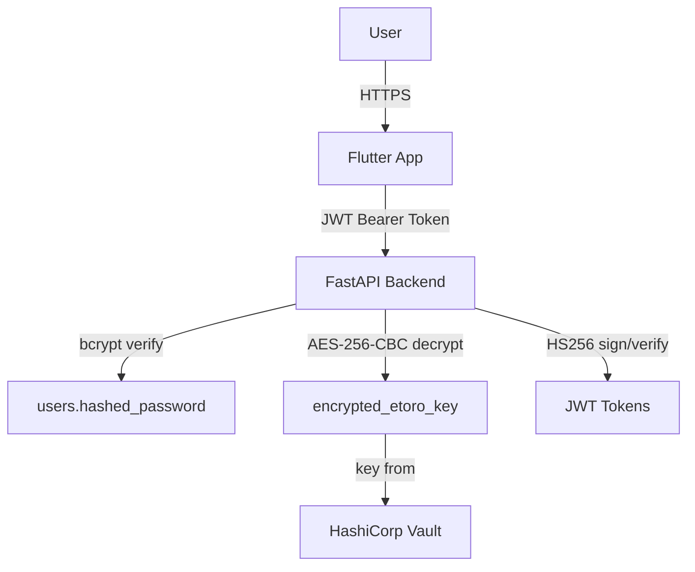

# 🔐 Security

Tags: #security #jwt #aes #bcrypt #vault #encryption

## Security Layers Overview



| Mechanism | Library | Purpose |
|---|---|---|
| Password hashing | `bcrypt` via `passlib` | Store user passwords safely |
| Session tokens | `python-jose` (HS256) | Authenticate API requests |
| Field encryption | `cryptography` AES-256-CBC | Protect eToro API keys in DB |
| Secret management | `hvac` (HashiCorp Vault) | Centralized AES master key storage |
| OAuth2 PKCE | Custom implementation | BT bank authorization code flow |

---

## Password Hashing

```python
def hash_password(password: str) -> str:
    salt = bcrypt.gensalt()
    return bcrypt.hashpw(password.encode(), salt).decode()

def verify_password(plain_password: str, hashed_password: str) -> bool:
    return bcrypt.checkpw(plain_password.encode(), hashed_password.encode())
```

- Uses `bcrypt` with auto-generated salt
- Stored as standard bcrypt hash string (60 characters)
- Minimum password length: 8 characters (enforced by Pydantic validator)

---

## JWT Authentication

```python
ALGORITHM = "HS256"
ACCESS_TOKEN_EXPIRE_MINUTES = 60 * 24  # 24 hours

def create_access_token(data: dict, expires_delta: timedelta | None = None) -> str:
    to_encode = data.copy()
    expire = datetime.now(timezone.utc) + (expires_delta or timedelta(minutes=1440))
    to_encode.update({"exp": expire})
    return jwt.encode(to_encode, settings.secret_key, algorithm=ALGORITHM)
```

> ⚠️ **Auth is not yet enforced on protected routes.** Tokens are issued at login and the
> Flutter client sends them as `Authorization: Bearer`, but the backend endpoints currently
> resolve the user via a hardcoded `DEFAULT_USER_ID = 1` rather than validating the token.
> A server-side `verify_token()` helper previously existed but was unused and has been removed.
> To add real per-user isolation, reintroduce it as a FastAPI dependency (`Depends`) on the
> routers and replace `DEFAULT_USER_ID` with the decoded `sub` claim.

### JWT Payload
```json
{
  "sub": "1",             // user.id as string
  "username": "john_doe",
  "exp": 1749340800       // expiry timestamp
}
```

### Token Lifecycle
1. **Login** → `POST /auth/login` → returns `{access_token, token_type: "bearer"}`
2. **Storage** → Flutter persists to `SharedPreferences`
3. **Usage** → Added as `Authorization: Bearer <token>` header on all API calls
4. **Expiry** → 24 hours; user must re-login (no refresh token for API auth)
5. **Restore** → `apiService.restoreSession()` at app startup loads from disk

---

## AES-256-CBC Field Encryption

Used to protect the eToro API key stored in the `users.encrypted_etoro_key` column.

### Encryption

```python
def encrypt_field(plaintext: str) -> str:
    key = _get_aes_key()                    # 32 bytes from Vault
    iv = os.urandom(16)                     # 128-bit random IV
    
    padder = padding.PKCS7(128).padder()
    padded = padder.update(plaintext.encode()) + padder.finalize()
    
    cipher = Cipher(algorithms.AES(key), modes.CBC(iv))
    ciphertext = cipher.encryptor().update(padded) + cipher.encryptor().finalize()
    
    payload = {
        "iv": base64.b64encode(iv).decode(),
        "c":  base64.b64encode(ciphertext).decode()
    }
    return base64.b64encode(json.dumps(payload).encode()).decode()
    # → base64(json({iv: base64(16-byte IV), c: base64(ciphertext)}))
```

### Decryption

```python
def decrypt_field(encrypted: str) -> str:
    payload = json.loads(base64.b64decode(encrypted))
    ciphertext = base64.b64decode(payload["c"])
    
    # Legacy AES-GCM support (backward compatibility)
    if "n" in payload:
        aesgcm = AESGCM(key)
        plaintext = aesgcm.decrypt(base64.b64decode(payload["n"]), ciphertext, None)
        return plaintext.decode()
    
    # Current: AES-256-CBC
    iv = base64.b64decode(payload["iv"])
    cipher = Cipher(algorithms.AES(key), modes.CBC(iv))
    padded = cipher.decryptor().update(ciphertext) + cipher.decryptor().finalize()
    unpadder = padding.PKCS7(128).unpadder()
    return (unpadder.update(padded) + unpadder.finalize()).decode()
```

### Stored Format
```
base64(json({"iv": base64(16-byte-IV), "c": base64(ciphertext)}))
```

> **Note:** The code comment says AES-256-**GCM** but the implementation uses AES-256-**CBC** with PKCS7 padding. Legacy AES-GCM entries are still decryptable.

---

## HashiCorp Vault (`core/vault.py`)

The AES master key is managed by HashiCorp Vault, preventing key exposure in application config or environment variables.

```python
class VaultManager:
    def _init_vault(self):
        if not self.client.is_authenticated():
            # Fallback: use FALLBACK_MASTER_KEY env var (dev only)
            return

        try:
            # Read existing key from KV v2 at secret/finance_advisor/master_key
            read_response = self.client.secrets.kv.v2.read_secret_version(
                mount_point='secret',
                path='finance_advisor/master_key'
            )
            self.master_key = read_response['data']['data']['key']
        except InvalidPath:
            # First run: generate and store a new 256-bit key
            new_key = base64.urlsafe_b64encode(os.urandom(32)).decode()
            self.client.secrets.kv.v2.create_or_update_secret(...)
            self.master_key = new_key
```

### Vault Configuration

| Env Var | Default | Description |
|---|---|---|
| `VAULT_ADDR` | `http://127.0.0.1:8200` | Vault server address |
| `VAULT_TOKEN` | `root` | Root token (dev mode) |
| `FALLBACK_MASTER_KEY` | Hardcoded dev key | Used when Vault is unreachable |

> ⚠️ The `FALLBACK_MASTER_KEY` default is insecure and **must** be overridden in production.

### Key Path in Vault
```
mount_point: secret (KV v2)
path: finance_advisor/master_key
field: key (base64-encoded 32-byte AES key)
```

---

## PKCE (RFC 7636) for BT OAuth2

The BT OAuth2 flow uses **Proof Key for Code Exchange** to prevent authorization code interception attacks:

```python
# During consent creation:
code_verifier = base64url(os.urandom(32))           # 256-bit random
code_challenge = base64url(sha256(code_verifier))   # S256 method

# Authorization URL includes:
# ?code_challenge=HASH&code_challenge_method=S256

# Token exchange sends:
# code_verifier=ORIGINAL_RANDOM
```

---

## Related Notes
- [[09 - BT PSD2 Bank Integration]]
- [[05 - Database Models]]
- [[11 - Fault Tolerance]]
