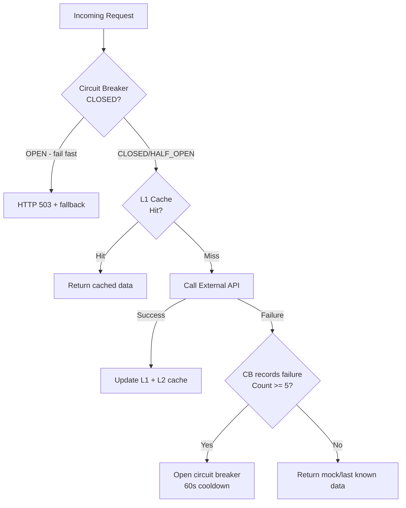
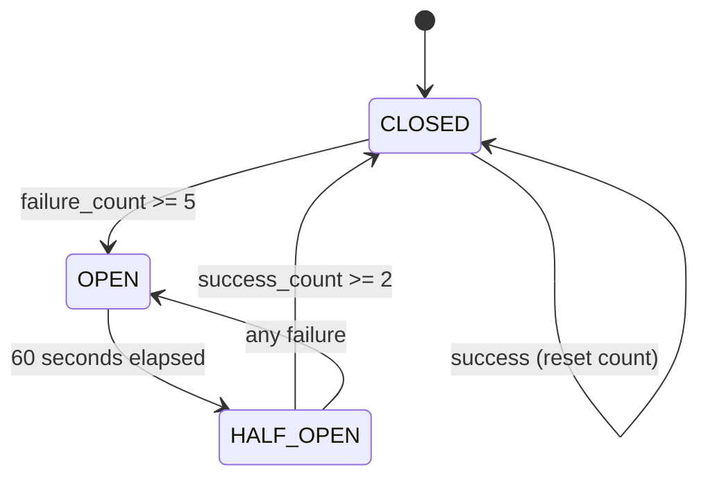

# 🛡️ Fault Tolerance & Resilience

Tags: #fault-tolerance #circuit-breaker #cache #resilience

## Overview

The system is designed to remain functional even when external APIs (eToro, Alpha Vantage) fail or are rate-limited. Three primary resilience patterns are used:



---

## 1. Circuit Breaker (`core/circuit_breaker.py`)

An **async-safe** circuit breaker implementation with three states:



### Configuration

```python
@dataclass
class CircuitBreakerConfig:
    failure_threshold: int = 5       # Failures before opening
    recovery_timeout: float = 60.0   # Seconds in OPEN before probing
    success_threshold: int = 2       # Successes in HALF_OPEN to close again
```

### Usage Pattern

```python
cb = get_circuit_breaker("etoro")
result = await cb.call(lambda: httpx_client.get(url))
```

### State Transitions

| Event | CLOSED | OPEN | HALF_OPEN |
|---|---|---|---|
| Success | Reset failure count | — | +1 success; if ≥ 2 → CLOSED |
| Failure | +1 failure; if ≥ 5 → OPEN | Reset timer | → OPEN |
| Timeout check | — | If ≥ 60s → HALF_OPEN | — |

### Pre-registered Breakers

Pre-registered on startup (appear in `/health` before first call):
```python
get_circuit_breaker("etoro")
get_circuit_breaker("alpha_vantage")
```

### Status in Health Endpoint

```json
{
  "circuit_breakers": [
    {
      "name": "etoro",
      "state": "CLOSED",
      "failure_count": 0,
      "last_failure_time": 0.0
    }
  ]
}
```

---

## 2. Two-Tier Cache (`services/cache_service.py`)

### Tier 1: In-Memory LRU Cache

```python
class _InMemoryLRU:
    """Thread-safe in-process LRU cache with per-entry TTL."""
    _cache: OrderedDict[str, tuple[Any, float]]   # value, expires_at
    _capacity: int = 256

    def get(self, key) -> Any | None:
        if key not in self._cache: return None
        value, expires_at = self._cache[key]
        if time.monotonic() > expires_at:
            del self._cache[key]
            return None
        self._cache.move_to_end(key)   # LRU eviction order update
        return value

    def set(self, key, value, ttl_seconds):
        self._cache[key] = (value, time.monotonic() + ttl_seconds)
        if len(self._cache) > self._capacity:
            self._cache.popitem(last=False)   # Evict LRU
```

| Property | Value |
|---|---|
| Capacity | 256 entries |
| Eviction | LRU (OrderedDict) |
| TTL | Per-entry, monotonic clock |
| Default TTL | 300 seconds (5 minutes) |

### Tier 2: Database Cache

DB-backed `cache_entries` table — survives process restarts, shared across horizontal replicas.

### Public Cache API

```python
cache_get(key: str) -> Any | None         # L1 read
cache_set(key, value, ttl_seconds=300)    # L1 write
cache_clear()                              # Wipe all L1
cache_stats() -> dict                     # {size, capacity}
```

---

## 3. Alpha Vantage Quota Guard

Alpha Vantage free tier: **25 requests/day**.

```python
ALPHA_VANTAGE_DAILY_LIMIT = 25
_av_daily_counter: dict[str, int] = {}   # {"YYYY-MM-DD": count}

def av_quota_remaining() -> int:
    today = datetime.now(timezone.utc).strftime("%Y-%m-%d")
    return max(0, 25 - _av_daily_counter.get(today, 0))

def av_quota_exceeded() -> bool:
    return av_quota_remaining() == 0

def av_increment_counter():
    today = get_av_daily_key()
    _av_daily_counter[today] = _av_daily_counter.get(today, 0) + 1
```

**Behavior when quota exceeded:**
1. Circuit breaker prevents new Alpha Vantage calls
2. Last cached stock quote is served from L1/L2 cache
3. `/health` reports `exceeded: true`

---

## 4. Database Connection Resilience

- **Async engine** (`asyncpg`) — non-blocking DB operations
- **Docker health check** — `pg_isready` prevents backend from starting before DB is ready
- **SQLAlchemy deadlock protection** — asyncpg handles transactional deadlocks with automatic retries

```yaml
# docker-compose.yaml
db:
  healthcheck:
    test: ["CMD-SHELL", "pg_isready -U $${POSTGRES_USER} -d $${POSTGRES_DB}"]
    interval: 10s
    timeout: 5s
    retries: 5

backend:
  depends_on:
    db:
      condition: service_healthy
```

---

## 5. Bulkhead Isolation

eToro and Alpha Vantage modules are completely decoupled:
- Separate circuit breakers per service
- A failure in eToro does **not** affect Alpha Vantage or the bank integration
- Each service has independent fallback (mock data / cached data)

---

## 6. Graceful Degradation Matrix

| Failure Scenario | System Response |
|---|---|
| eToro API down | Circuit breaker opens; mock portfolio data served |
| Alpha Vantage rate limit (25/day) | Quota guard trips; serve cached quotes |
| BT PSD2 API unavailable | HTTP 503 returned; user can use demo mode |
| HashiCorp Vault unreachable | `FALLBACK_MASTER_KEY` env var used (dev only) |
| PostgreSQL down | HTTP 500; health shows `status: "degraded"` |
| No Google API key | Tori returns offline message (MockLLM) |

---

## Related Notes
- [[03 - FastAPI Application]]
- [[12 - Cache Service]]
- [[09 - BT PSD2 Bank Integration]]
