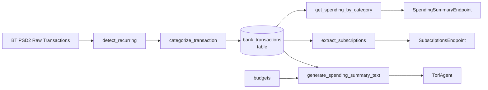

# 📊 Expense Categorizer

Tags: #expense #categorization #nlp #subscriptions

## Overview

`app/services/expense_categorizer.py` provides:
1. **Keyword-based transaction categorization** — fast, offline, no LLM needed
2. **Recurring / subscription detection** — keyword + monthly pattern matching
3. **Spending aggregation** — per category, per month
4. **Subscription extraction** — unique list with amounts and frequency
5. **Spending summary text** — human-readable summary for Tori

---

## Category Taxonomy

| Category | Sample Keywords |
|---|---|
| **Food & Groceries** | kaufland, lidl, carrefour, auchan, mega image, profi, penny, supermarket |
| **Transport** | omv, petrom, mol, bolt, uber, taxi, metrou, cfr, tarom, wizz, ryanair |
| **Utilities** | enel, digi, orange, vodafone, telekom, electrica, e.on, internet |
| **Dining** | mcdonald, kfc, pizza hut, burger king, starbucks, restaurant, bistro, cafe |
| **Shopping** | dedeman, altex, emag, zara, h&m, ikea, jysk, pepco |
| **Health** | farmacie, catena, dr. max, sensiblu, regina maria, medicover, clinica |
| **Entertainment** | cinema city, hbo, netflix, spotify, steam, playstation, teatru, concert |
| **Subscriptions** | netflix, spotify, adobe, microsoft 365, apple, google play, youtube premium |
| **Rent** | chirie, imobiliare, locatar, apartament, studio inchiriat |
| **Income** | salariu, salary, angajator, dividende, transfer primit |
| **Other** | (fallback) |

---

## `categorize_transaction(remittance_info, creditor_name) → str`

```python
def categorize_transaction(remittance_info: str, creditor_name: str) -> str:
    text = f"{remittance_info or ''} {creditor_name or ''}".lower()
    for category, keywords in _KEYWORD_MAP.items():
        for kw in keywords:
            if kw in text:
                return category
    return "Other"
```

**Approach:** Simple substring match on lowercased concatenation of remittance info and creditor name. First match wins — category order in the dict determines priority.

---

## `detect_recurring(transactions) → list[dict]`

Marks transactions with `_isRecurring = True` based on:

```python
def detect_recurring(transactions: list[dict]) -> list[dict]:
    # Step 1: Build creditor → dates map
    creditor_dates: dict[str, list[date]] = defaultdict(list)

    # Step 2: Flag as recurring if:
    #   - Same creditor appears in 2+ different months
    #   - Day-of-month differs by ≤ 3 days (billing cycle tolerance)
    for cname, dates in creditor_dates.items():
        if len(dates) >= 2:
            days = [d.day for d in dates]
            months = [d.month for d in dates]
            if len(set(months)) >= 2 and (max(days) - min(days)) <= 3:
                recurring_creditors.add(cname)

    # Step 3: Also flag via subscription keyword match
    for tx in transactions:
        is_keyword_sub = any(kw in text for kw in _SUBSCRIPTION_KEYWORDS)
        is_pattern_rec = cname in recurring_creditors
        tx["_isRecurring"] = is_keyword_sub or is_pattern_rec
```

---

## `get_spending_by_category(transactions, month_year) → dict[str, float]`

```python
def get_spending_by_category(transactions, month_year=None) -> dict[str, float]:
    # Only count DEBIT (outgoing) transactions
    # Filter: amount < 0 (negative = money out)
    # Filter: category != "Income"
    # Group by category, sum absolute amounts
    # Return sorted by amount descending
```

---

## `extract_subscriptions(transactions) → list[dict]`

Extracts unique subscription entries from flagged recurring transactions:

```python
# Only includes: category in ("Subscriptions", "Utilities")
# Returns: one entry per merchant with:
{
    "merchant": "Netflix",
    "amount": 45.0,
    "currency": "RON",
    "category": "Subscriptions",
    "last_charge": "2026-06-01",
    "frequency": "monthly"
}
```

Sorted by amount descending.

---

## `generate_spending_summary_text(spending, budgets, month_year) → str`

Generates a human-readable text that Tori returns directly to the user:

```
📊 Spending Summary for 2026-06:
Total spent: 2340.50 RON

  🔴 OVER Dining: 1100.00 / 1000.00 RON (110%)
  🟡 Food & Groceries: 620.00 / 800.00 RON (78%)
  🟢 Transport: 180.00 / 400.00 RON (45%)
  • Shopping: 440.50 RON
```

### Status Thresholds

| Symbol | Condition |
|---|---|
| 🔴 OVER | Spent > 100% of budget limit |
| 🟡 | Spent 75–100% of budget limit |
| 🟢 | Spent < 75% of budget limit |
| • | No budget set for this category |

---

## Integration Points



---

## Related Notes
- [[09 - BT PSD2 Bank Integration]]
- [[06 - Tori Agent]]
- [[04 - API Endpoints Reference]]
