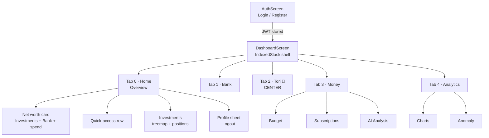

# 📱 Flutter Frontend

Tags: #flutter #dart #mobile #frontend #ui

## Overview

The Flutter application is a **cross-platform** (Android, iOS, Web, Desktop) dark-themed financial dashboard built with **Material 3** and the **Inter** font family (Google Fonts). It follows a GitHub-style dark palette (`#0D1117` background, `#58A6FF` accent).

```
flutter_app/lib/
├── main.dart                    # App entry point + theme + session restore
├── screens/
│   ├── auth_screen.dart          # Login + Registration (real JWT auth)
│   ├── dashboard_screen.dart     # 5-tab shell (IndexedStack) + Home overview
│   ├── bank_screen.dart          # BT account + transactions + connect flow
│   ├── budget_screen.dart        # Budget management
│   ├── chart_screen.dart         # Market line charts (per symbol)
│   ├── chat_screen.dart          # Tori AI chat (auto-scroll, generative UI)
│   ├── anomaly_screen.dart       # ML anomaly results (auto-runs)
│   ├── expense_ai_screen.dart    # AI expense insights + spending treemap
│   └── subscription_screen.dart  # Subscription tracker
├── services/
│   └── api_service.dart          # HTTP client + JWT session management
├── theme/
│   └── app_colors.dart           # Single source of truth for the palette
├── utils/
│   └── money.dart                # Shared RON/USD formatters
├── models/
│   ├── anomaly_model.dart
│   ├── bank_model.dart
│   ├── budget_model.dart
│   └── portfolio_model.dart
└── widgets/
    ├── generative_ui.dart         # Renderer for Tori's generated UI widgets
    ├── treemap_chart.dart         # Squarified treemap (allocation + spending)
    └── empty_state.dart           # Reusable empty-list placeholder
```

---

## Shared Foundations (consistency)

| File | Purpose |
|---|---|
| `theme/app_colors.dart` | `AppColors.*` — the GitHub-dark palette + categorical chart colours. Screens reference these instead of redeclaring hex literals. |
| `utils/money.dart` | `Money.ron()`, `Money.ronCompact()`, `Money.usd()` — consistent currency formatting (thousands separators) across Bank, Expense, Subscriptions. |
| `widgets/empty_state.dart` | One `EmptyState` widget used by all list screens (Bank, Budget, Subscriptions, Expense) for "no data" placeholders. |

**Conventions:**
- Both hubs' sub-screens render **without their own app bar** (the hub provides the header + TabBar) — no duplicate title bars.
- Every data screen has consistent **loading → error (with Retry) → empty → content** states.

---

## App Entry Point (`main.dart`)

```dart
void main() async {
  WidgetsFlutterBinding.ensureInitialized();
  await apiService.restoreSession();   // Restore JWT from SharedPreferences
  runApp(const FinanceAdvisorApp());
}
```

```dart
ThemeData(
  brightness: Brightness.dark,
  primaryColor: const Color(0xFF58A6FF),            // GitHub-style blue
  scaffoldBackgroundColor: const Color(0xFF0D1117), // GitHub dark background
  textTheme: GoogleFonts.interTextTheme(ThemeData.dark().textTheme),
  useMaterial3: true,
)
```

**Routing on launch:** if a JWT was restored from disk → `DashboardScreen(initialIndex: 0)` (Home). Otherwise → `AuthScreen`.

---

## Navigation Map



> **Why `IndexedStack`?** All five tabs are kept alive simultaneously. Switching tabs preserves scroll position, Tori chat history, and any in-progress chat input — instead of rebuilding the screen each time.

---

## `DashboardScreen` — the shell

A 5-destination `NavigationBar` with the Tori AI button as a highlighted gradient circle in the center.

| Tab | Label | Content |
|---|---|---|
| 0 | **Home** | Overview: net worth + quick-access + investments |
| 1 | **Bank** | `BankScreen` (BT PSD2) |
| 2 | **Tori** 🤖 | `ChatScreen` (center, gradient button) |
| 3 | **Money** | Nested `TabBar`: Budget · Subscriptions · AI Analysis |
| 4 | **Analytics** | Nested `TabBar`: Charts · Anomaly |

```dart
// IndexedStack keeps every tab alive → state survives tab switches.
body: IndexedStack(index: _selectedIndex, children: screens),
```

### Home / Overview (Tab 0)
- **"Your Money" card** — Investments (USD) and Bank (RON) shown **side-by-side in their own currencies** (not summed, to avoid a misleading cross-currency total), plus this-month spend and portfolio P&L %.
- **Quick-access row** — one-tap chips to Bank, Budget, Subs, Expenses, Analytics, Tori. These **deep-link to the exact sub-tab** inside a hub (e.g. Subs → Money hub, tab 1) via State-owned `TabController`s, so "Subs" opens Subscriptions rather than the hub's default first tab.
- **Investments** — allocation treemap + position cards (resilient: shows an "unavailable" card if the portfolio call fails).
- **Data-source badge** — `LIVE` vs `DEMO`, derived honestly from the data (the mock portfolio reports `username == 'demo_user'`).
- **Profile sheet** — username + **Log out** (clears JWT, returns to `AuthScreen`).

```dart
// Honest data-source indicator
bool get _isLive =>
    _portfolio != null && _portfolio!.username != 'demo_user' &&
    _portfolio!.username.isNotEmpty;
```

---

## Screens

### `AuthScreen` — real authentication
- **Login / Register toggle** in a single screen.
- **Login:** `username + password` → `POST /auth/login` → JWT decoded for `userId`/`username`, persisted to disk.
- **Register:** `username + email + password` → `POST /auth/register`, then auto-login.
- Client-side validation (username required, email format, password ≥ 8 chars).
- Inline error banner with human-friendly messages; password visibility toggle.

### `BankScreen` — simplified connect flow
- **Primary CTA:** "Connect Demo Data" (`POST /bank/sandbox-authorize`) — the reliable path for the thesis demo.
- **Advanced (developer) options** — collapsed `ExpansionTile` hiding the real-OAuth paths (Open BT Login, Auto-connect Sandbox, "I have completed authentication"). Technical jargon (consent / AISP 401) was rewritten in plain language.
- **Connected view:** account card (balance, masked IBAN), horizontal month selector, transaction list with category icon + colored badge + recurring marker.
- **Empty state:** `EmptyState` with a "Sync now" action when a month has no transactions.
- App-bar actions: Sync (from BT) and Disconnect; `SANDBOX` / `DEMO DATA` badge.

### `ChatScreen` (Tori)
- User / Tori message bubbles; **Markdown** rendering via `flutter_markdown`.
- **Generative UI** — parses ` ```widget ``` ` JSON blocks and renders interactive widgets.
- **Reliable auto-scroll** — pins to the true bottom across the multi-pass layout of markdown/widgets (post-frame jump + re-pin at 200 ms & 450 ms); jumps instantly on history load.

### `BudgetScreen`
- Create budget via bottom-sheet dialog (category + limit).
- Status bars colored ok / warning / exceeded by % used; month selector; empty + error states.
- **Swipe-to-delete** — each budget card is a `Dismissible` (swipe → confirm dialog → `DELETE /budget/{budget_id}` → reload). Relies on `budget_id` now included in the status response.

### `AnomalyScreen`
- **Auto-runs** the ML ensemble when portfolio positions are available (on load, and when positions arrive via `didUpdateWidget`).
- Empty guard: if no positions, shows a "load your portfolio first" hint instead of a dead button.
- Displays per-model scores + weighted average + confidence verdict card.

### `ExpenseAIScreen`
- AI narrative summary (Gemini) + **spending treemap** + category breakdown; month selector.

### `SubscriptionScreen`
- Recurring charges from `GET /bank/subscriptions`: merchant, amount, last charge, frequency; monthly/yearly totals; empty + error states.

### `ChartScreen`
- Per-symbol selector → 30-day line chart (`fl_chart`) + current quote card (live/mock source label).

---

## `ApiService` (`services/api_service.dart`)

Singleton HTTP client. All API calls route through this class.

### Base URL Resolution
```dart
static String get baseUrl {
  const fromEnv = String.fromEnvironment('API_BASE_URL');
  if (fromEnv.isNotEmpty) return fromEnv;     // Docker build arg / CI
  return 'http://192.168.1.15:8001/api/v1';   // fallback for physical device
}
```
The Docker web build injects `API_BASE_URL=http://localhost:8001/api/v1` via `--dart-define`.

### Session Management (JWT)
```dart
// Decode the JWT payload to extract user id (sub) and username
void _decodeToken(String token) {
  _token = token;
  final parts = token.split('.');
  var payload = parts[1];
  payload += '=' * ((4 - payload.length % 4) % 4);  // base64 padding
  final map = jsonDecode(utf8.decode(base64Url.decode(payload)));
  userId = int.tryParse(map['sub']?.toString() ?? '');
  username = map['username']?.toString();
}
```
- `restoreSession()` — load token/userId/username from `SharedPreferences` at startup.
- `_persistSession()` — save them after a successful login.
- `logout()` — clear token + persisted keys.

### Key API Methods

| Method | HTTP | Endpoint |
|---|---|---|
| `login()` / `register()` | POST | `/auth/login`, `/auth/register` |
| `getPortfolio()` | GET | `/etoro/portfolio` |
| `analyzePortfolio()` | POST | `/anomaly/analyze` |
| `chatWithTori()` / `fetchHistory()` | POST/GET | `/agent/chat`, `/agent/history/{id}` |
| `connectBank()` / `sandboxAuthorize()` / `sandboxAutoConnect()` / `disconnectBank()` | POST | `/bank/...` |
| `getBankAccounts()` / `getBankBalances()` / `getBankTransactions()` / `syncBank()` | GET/POST | `/bank/...` |
| `getSpendingSummary()` / `getSubscriptions()` | GET | `/bank/...` |
| `getBudgetStatus()` / `createBudget()` / `deleteBudget()` | GET/POST/DELETE | `/budget/...` |
| `getExpenseInsights()` / `getExpenseCategories()` | GET | `/expenses/...` |
| `getQuote()` / `getStockHistory()` | GET | `/market/...` |

---

## Generative UI (`widgets/generative_ui.dart`)

Tori's responses may contain `widget` fenced code blocks, parsed and rendered as interactive widgets:

```jsonc
{ "type": "budget_slider", "category": "Dining", "limit": 1000 }
{ "type": "receipt", "merchant": "eMAG", "amount": 150.5, "date": "2026-06-05", "category": "Shopping" }
{ "type": "action_button", "label": "Sync Bank", "action": "sync_bank" }
```

- **`action_button`** is stateful: it shows a "Working…" spinner and disables while the action
  runs (e.g. a multi-second `/bank/sync`), then surfaces the real result ("Synced N new
  transaction(s)" / "Already up to date") — so it never looks inert/dead on a slow connection.

---

## Treemap Chart (`widgets/treemap_chart.dart`)

Dependency-free **squarified treemap** (Bruls–Huizing–van Wijk) — area ∝ value, auto-contrast text, hides labels on slivers too small to read. Replaced the previous pie/donut charts.

- **Dashboard → Investments:** portfolio holdings sized by current value.
- **Expense AI → Spending by Category:** categories sized by spend.

```dart
TreemapChart(tiles: [
  TreemapTile(label: 'GOOG', value: 2077.35, color: ..., sublabel: '\$2077'),
  ...
], height: 220);
```

---

## Empty State (`widgets/empty_state.dart`)

Reusable placeholder for empty lists: circular icon + title + message + optional action button. Used by Bank transactions ("Sync now"); Budget and Subscriptions have their own variants.

---

## FFI / Desktop Workaround

```yaml
# pubspec.yaml
dependency_overrides:
  path_provider_android: "2.2.22"   # avoid NativeCallable FFI crash (Dart 3.12)
```

> ⚠️ Run with `flutter run -d chrome` to avoid NativeCallable FFI crashes on Windows desktop. Physical Android/iOS devices and the Docker web build work fine.

---

## Related Notes
- [[04 - API Endpoints Reference]]
- [[06 - Tori Agent]]
- [[09 - BT PSD2 Bank Integration]]
- [[17 - eToro & Market Data]]
- [[10 - Security]]
