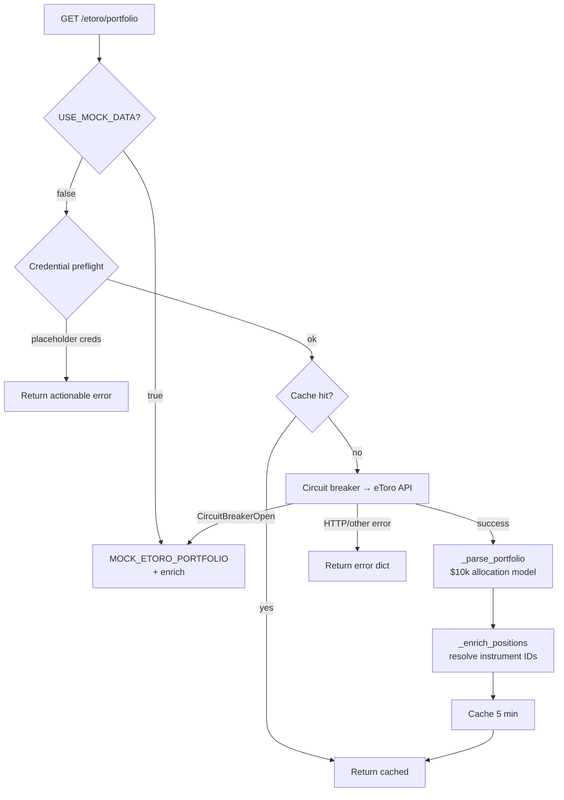

# 📈 eToro & Market Data Integration

Tags: #etoro #market-data #alpha-vantage #portfolio #circuit-breaker

## Overview

Two external data sources power the investment side of the app:

| Service | Purpose | Module |
|---|---|---|
| **eToro Public API** | A user's live portfolio (social-trading data) + instrument metadata | `services/etoro.py`, `services/instrument_resolver.py` |
| **Alpha Vantage** | Stock quotes + OHLCV history | `services/market_data.py` |

Both are wrapped with a **circuit breaker**, **LRU+TTL cache**, and **mock-data fallback** so the app never hard-fails. See [[11 - Fault Tolerance]] and [[12 - Cache Service]].

---

## eToro Public API

**Base URL:** `https://public-api.etoro.com` (configured via `ETORO_BASE_URL`)

**Auth headers (every request):**

| Header | Meaning | Source |
|---|---|---|
| `x-api-key` | Identifies the **application** (shared) | eToro API portal |
| `x-user-key` | Identifies the **user account** | eToro → Settings → Trading → API Key Management |
| `x-request-id` | Unique UUID per request | generated |

### Two classes of endpoint

```mermaid
graph LR
    subgraph "Public / social-trading (used here)"
        P[GET /api/v1/user-info/people/&#123;username&#125;/portfolio/live]
        U[GET /api/v1/user-info/people?usernames=...]
        M[GET /api/v1/market-data/instruments?instrumentIds=...]
        T[GET /api/v1/market-data/instrument-types]
    end
    subgraph "Private own-account (needs scopes)"
        D[GET /api/v1/trading/info/demo/pnl]
        R[GET /api/v1/trading/info/pnl]
    end
```



> **Key distinction:** the app fetches a **public** user's portfolio (`/user-info/people/{username}/portfolio/live`). This works with a standard key. The **own-account** endpoints (`/trading/info/...`) require a key with the matching scope (`etoro-public:demo:read` = scope id `201`) and return `403 InsufficientPermissions` otherwise.

### Scope IDs (for `create-user-token`)

| Scope ID | Permission |
|---|---|
| 200 | `etoro-public:real:read` |
| 201 | `etoro-public:demo:read` |
| 202 | `etoro-public:real:write` |
| 203 | `etoro-public:demo:write` |

---

## Portfolio Fetch & Parsing

`GET /etoro/portfolio` → `EtoroService.get_live_portfolio()`.

### Flow



### Response shape (public endpoint)

```jsonc
{
  "realizedCreditPct": 0.06,        // % of portfolio held as cash
  "unrealizedCreditPct": 0.05,
  "positions": [
    {
      "positionId": 3326495681,
      "openRate": 11.56,             // entry price
      "instrumentId": 2405,
      "isBuy": true,
      "investmentPct": 4.05,         // % of portfolio allocated
      "netProfit": 0.20,             // P&L % on this position
      "leverage": 1
    }
    // ... summed investmentPct + realizedCreditPct ≈ 100
  ],
  "socialTrades": [ /* copied traders */ ]
}
```

### The $10,000 baseline model (`_parse_portfolio`)

The public API exposes only **allocation percentages**, never another user's real balance. The service models the portfolio against a **$10,000 baseline**: each position's `investmentPct` is applied to $10k, then `netProfit %` yields its current value. Splits of the same instrument are aggregated.

```python
INITIAL_TOTAL = 10000.0
invested     = (investmentPct / 100) * INITIAL_TOTAL
current_val  = invested * (1 + netProfit / 100)
cash         = (realizedCreditPct / 100) * INITIAL_TOTAL
total_value  = sum(current_val) + cash
```

> ⚠️ **Honesty note:** the absolute dollar figures are a normalized projection — the **percentages and relative weights are real**, the total is modeled. This is an eToro privacy limitation, not a bug.

---

## Instrument Resolution (`services/instrument_resolver.py`)

Translates a numeric eToro `instrumentId` → `{symbol, name, asset_class}`.

```mermaid
flowchart LR
    Pos[position.instrumentId] --> Mapped{is_mapped?}
    Mapped -->|yes| Use[Use cached/static mapping]
    Mapped -->|no| Fetch[GET /api/v1/market-data/instruments]
    Fetch --> Reg[register symbol+name+class]
    Reg --> Use
    Fetch -->|fails| Fallback[Return ID_&#123;id&#125; — NOT cached]
    Fallback -.retry next fetch.-> Mapped
```



### Auto-heal of unknown instruments
- `_enrich_positions` fetches metadata for any ID that is **not yet mapped** (`is_mapped`, not merely `is_seen`).
- `resolve()` **does not cache** the `Unknown` fallback — so an unresolved ID is retried on the next portfolio fetch instead of being permanently stuck.
- Net effect: unknown instruments resolve themselves automatically as soon as the metadata endpoint succeeds.

### Metadata endpoint
`GET /api/v1/market-data/instruments?instrumentIds=1002,2405` →
```jsonc
{ "instrumentDisplayDatas": [
  { "instrumentID": 1002, "symbolFull": "GOOG",
    "instrumentDisplayName": "Alphabet", "instrumentTypeID": 5 }
]}
```

### Instrument type IDs

| ID | Asset class | ID | Asset class |
|---|---|---|---|
| 1 | Forex | 6 | ETF |
| 2 | Commodities | 7 | Bonds |
| 3 | CFD | 8 | TrustFunds |
| 4 | Indices | 9 | Options |
| 5 | Stocks | 10 | Crypto |

---

## Credential Preflight

Before any live call, `etoro_credential_problem()` detects unusable credentials and returns an actionable message instead of a cryptic HTTP error:
- `.env` placeholder values (`your_etoro_api_key`, etc.).
- It deliberately **does not** reject an `UnregisteredApplication` user key — that key is sufficient for **public** portfolio reads (only the private own-account endpoints need elevated scopes).

---

## Market Data — Alpha Vantage (`services/market_data.py`)

**Base URL:** `https://www.alphavantage.co/query`

| Endpoint | Function | Notes |
|---|---|---|
| `GET /market/quote/{symbol}` | `GLOBAL_QUOTE` | Real-time quote; works on the free tier |
| `GET /market/history/{symbol}` | `TIME_SERIES_DAILY` / `DIGITAL_CURRENCY_DAILY` | 30-day OHLCV; premium-gated → falls back to mock |

### Guards (in order)
1. **Mock mode** — `USE_MOCK_DATA=true` returns mock immediately.
2. **Cache** — quotes 60 min, history 24 h (LRU + TTL).
3. **Quota** — hard 25 req/day cap; exceeding → mock with `_fallback: quota_exceeded`.
4. **Circuit breaker** — repeated failures open the breaker → mock.
5. **Symbol/ID resolution** — accepts `ID_1234` or numeric IDs, resolved to a symbol first.

> Quotes set `"source": "live"` or `"mock"` so the UI can label them honestly.

---

## Resilience Summary

| Failure | eToro Portfolio | Market Quote | Market History |
|---|---|---|---|
| `USE_MOCK_DATA=true` | mock portfolio | mock quote | mock history |
| Circuit open | mock portfolio | mock quote | mock history |
| HTTP 4xx/5xx | error dict (400) | mock | mock |
| No internet | error dict (400) | mock | mock |

See [[11 - Fault Tolerance]] for circuit-breaker mechanics and [[01 - System Overview]] for the global picture.

---

## Configuration (`.env`)

```ini
ETORO_API_KEY=<application key (x-api-key)>
ETORO_USER_KEY=<user key (x-user-key)>
ETORO_BASE_URL=https://public-api.etoro.com
ETORO_ENV=demo                 # demo → /trading/info/demo/* for own-account calls
ETORO_USERNAME=Aguero1010      # public profile whose portfolio is displayed
ALPHA_VANTAGE_API_KEY=<key>
USE_MOCK_DATA=true             # master switch for offline/demo mode
```

---

## Related Notes
- [[11 - Fault Tolerance]]
- [[12 - Cache Service]]
- [[04 - API Endpoints Reference]]
- [[14 - Flutter Frontend]]
- [[01 - System Overview]]
